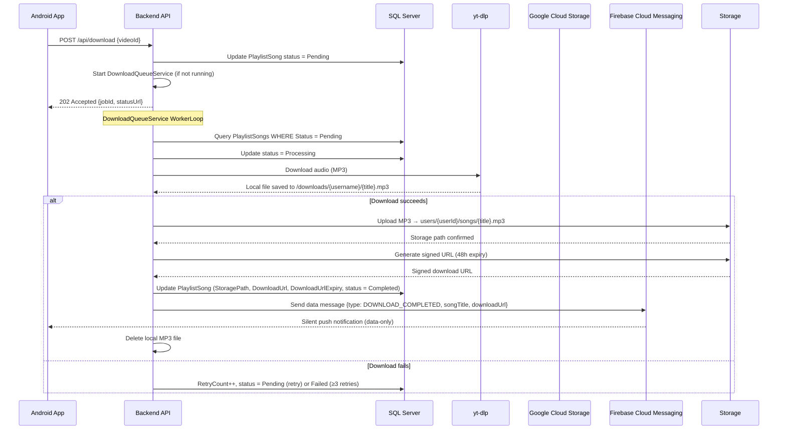
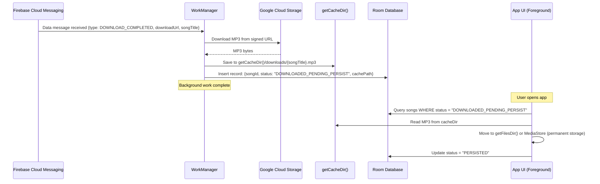
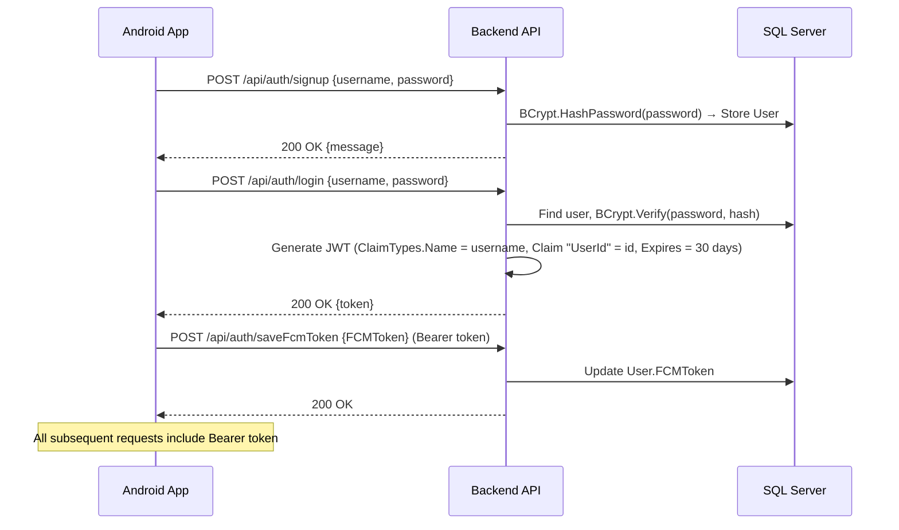
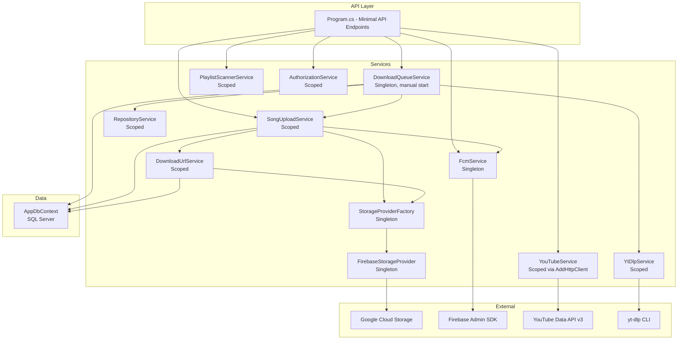
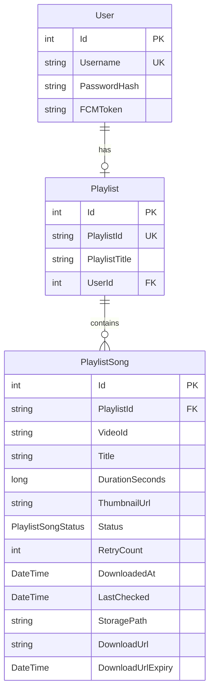

# YTdownloadBackend — Architecture & Flow Documentation

## System Overview

YTdownloadBackend is a .NET 10.0 Minimal API that lets authenticated users save YouTube playlists, scan for new songs, download audio via yt-dlp, upload to Google Cloud Storage (GCS), and notify Android clients via FCM.

---

## Core Download Flow (Server → Android)

### Step-by-Step Breakdown

| Step | Component | Action |
|------|-----------|--------|
| 1 | Android App | User taps "Download" → `POST /api/download {videoId}` |
| 2 | API | Validates ownership (user → playlist → song), sets `Status = Pending`, enqueues |
| 3 | DownloadQueueService | Polls DB for `Pending` songs, sets `Status = Processing` |
| 4 | YtDlpService | Runs `yt-dlp --restrict-filenames -x --audio-format mp3 -o "{downloads}/{username}/%(title)s.%(ext)s" {videoId}` |
| 5 | SongUploadService | Verifies local file exists, checks storage for duplicates via IStorageProvider, uploads MP3 |
| 6 | DownloadUrlService | Generates signed URL (48h default) via IStorageProvider, caches in DB with expiry |
| 7 | SongUploadService | Updates DB: `Status = Completed`, `StoragePath`, `DownloadUrl`, `DownloadUrlExpiry` |
| 8 | FcmService | Sends **data-only** FCM message: `{type, songTitle, downloadUrl, timestamp}` |
| 9 | SongUploadService | Deletes local MP3 file |
| 10 | Android App | Receives FCM data message → WorkManager downloads MP3 from signed URL |

---

## Android Background Download Flow (Client-Side)

This is the **recommended** approach for the Android client to handle FCM-triggered downloads:

### Key Design Decisions

| Decision | Rationale |
|----------|-----------|
| **Data-only FCM message** (not notification) | Silent push triggers WorkManager without showing UI |
| **Download to `getCacheDir()`** | Background workers CAN write to cache; cannot write to app-specific persistent storage in background |
| **Room DB for tracking** | Lightweight SQLite on Android; tracks "downloaded but not yet persisted" state |
| **Move on app open** | Foreground app has full storage access; moves from cache → permanent location |
| **NOT IndexedDB** | IndexedDB is a browser API, not available in native Android; bad for large binary files |

### Signed URL Expiry Risk

| Risk | Mitigation |
|------|------------|
| 48h signed URL may expire before Android downloads | **Option A**: Extend to 7 days (GCS supports up to 7d) |
| | **Option B**: Add `GET /api/songs/{id}/refresh-url` endpoint that generates a fresh URL |
| | **Option C**: Android checks URL freshness before download; if expired, calls refresh endpoint |

**Recommended**: Option A (extend to 7 days) + Option B (refresh endpoint as fallback)

---

## Authentication Flow

### Current Auth Issues (to be fixed in Phase 1)

- JWT secret is **hardcoded** in `appsettings.json` — must move to environment variable only
- Token expiry is **30 days** — too long; should be reduced (e.g., 1-7 days with refresh tokens)
- No `ValidateIssuer` / `ValidateAudience` — token accepted from any source
- Some endpoints check `http.User.Identity?.Name` manually instead of using `IAuthorizationService`

---

## Service Architecture

---

## API Endpoints Summary

| Method | Path | Auth | Purpose |
|--------|------|------|---------|
| GET | `/health` | Anonymous | Health check |
| GET | `/api/healthCheck` | Bearer | Debug: sends FCM test message (uses configured token) |
| GET | `/api/uploadTest` | Bearer | Debug: tests upload pipeline with hardcoded file ⚠️ |
| POST | `/api/savePlaylist` | Bearer | Save/replace user's YouTube playlist |
| GET | `/api/getPlaylist` | Bearer | Get user's saved playlist |
| GET | `/api/getSongs` | Bearer | Scan for new songs + list all songs in playlist |
| POST | `/api/download` | Bearer | Enqueue a song for download |
| POST | `/api/auth/signup` | Anonymous | Create new user account |
| POST | `/api/auth/login` | Anonymous | Authenticate and get JWT |
| POST | `/api/auth/saveFcmToken` | Bearer | Save device FCM token for push notifications |

---

## Data Model

### Known Data Issues

- `PlaylistSong.PlaylistId` is a **string FK** to `Playlist.PlaylistId` (not `Playlist.Id`) — migration shows `PlaylistId1` as nullable
- `PlaylistSongStatus` enum has gaps: `Pending=1, Processing=3, Completed=4, Failed=5` (missing 2)
- No `OnModelCreating` override for Fluent API configuration

---

## Configuration (appsettings.json)

| Key | Current Value | Issue |
|-----|---------------|-------|
| `Jwt:Secret` | Hardcoded 74-char hex string | ⚠️ Must be env-var only |
| `YouTube:ApiKey` | Blank placeholder | Needs real key or env var |
| `Firebase:StorageBucket` | `"ytdownloder"` | Typo (should be "ytdownloader"?) |
| `ConnectionStrings:DefaultConnection` | Local SQL Express | OK for dev |
| Firebase key file path | Hardcoded in Program.cs | Should be in config |

---

## Refactoring Plan

### Phase 1: Security & Correctness Fixes
1. Move JWT Secret to environment variables only (remove from appsettings.json)
2. Remove hardcoded FCM token from `/api/healthCheck` endpoint
3. Move Firebase key file path to configuration
4. Fix `throw ex` → `throw` in SongUploadService.cs (preserves stack trace)
5. Gate debug endpoints (`/api/healthCheck`, `/api/uploadTest`) behind `#if DEBUG`
6. Add `RequireAuthorization()` consistently to all protected endpoints
7. Reduce JWT token expiry from 30 days to 7 days

### Phase 2: Structural Refactoring
8. Extract endpoints from Program.cs into separate files (Endpoints/ folder)
9. Create `ServiceCollectionExtensions.cs` for DI registration
10. Create separate test project, move test packages out of production
11. Remove `AWSSDK.S3` (completely unused)
12. Remove dead code: `RabbitMqPublisher`, `WeatherForecast` record, commented-out code blocks
13. Fix doubled namespaces in Models and Services

### Phase 3: Service Layer Improvements
14. Convert `DownloadQueueService` to proper `BackgroundService` / `IHostedService`
15. Replace `Console.WriteLine` with `ILogger` in `YtDlpService`, `PlaylistScannerService`
16. Create `IRepositoryService` interface for `RepositoryService`
17. Standardize auth pattern (use `IAuthorizationService` everywhere)
18. Fix `PlaylistSongStatus` enum gaps (sequential: 0,1,2,3)
19. Fix `YtDlpService` constructor (remove hardcoded path, use config)
20. Fix typos: `helthCheck` → `healthCheck`, `Authinticad` → `Authenticated`

### Phase 4: Data Layer Fixes
21. Add `OnModelCreating` with Fluent API for FK relationships
22. Align EF Core package versions with .NET 10 target
23. Fix `PlaylistSong → Playlist` FK relationship (required, cascade delete)
